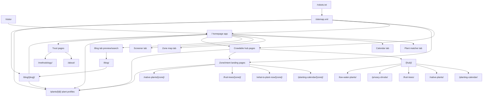
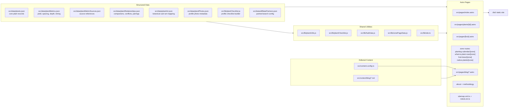
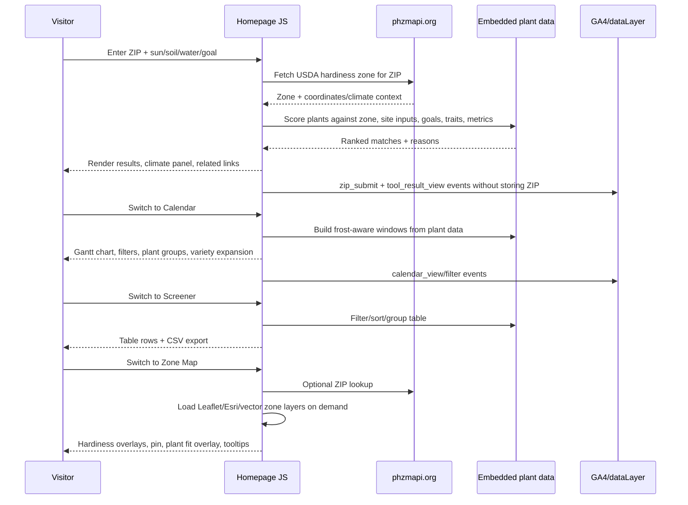
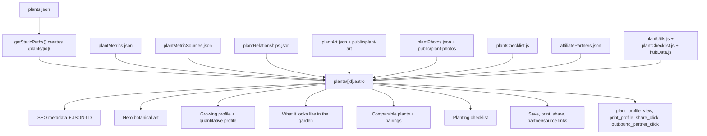
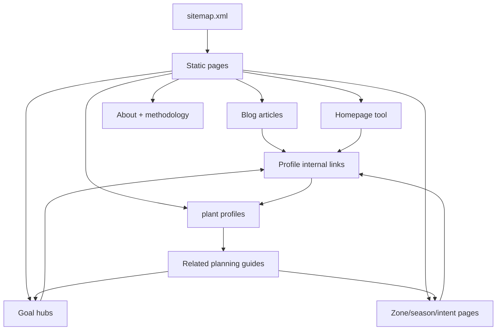
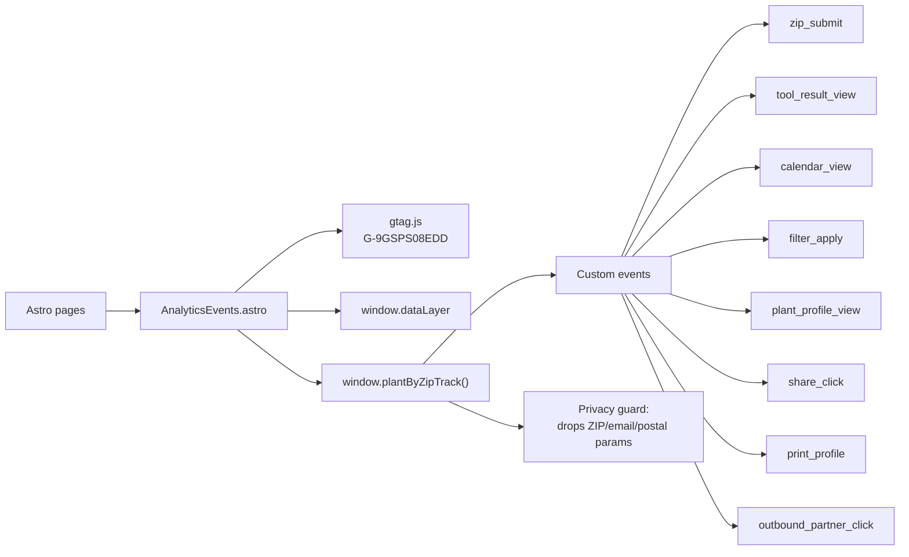
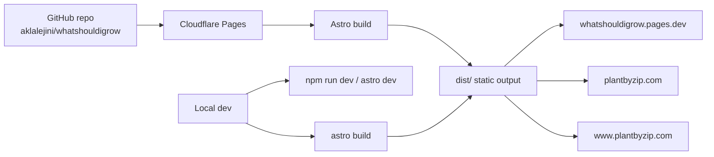

# Plant by ZIP Site Structure

This is a high-level reference for how Plant by ZIP is organized, how data moves through the site, and where the main user-facing experiences live.

## Route Map

## Source Files And Responsibilities

## Homepage App Flow

The homepage is the main interactive app. It ships plant data and helper data into browser-side JavaScript, then updates the UI without a server.

## Plant Profile Flow

Each plant profile is statically generated from `plants.json`. The page combines core plant data with metrics, art, real photos, relationships, checklist items, source methodology, and share/print/partner actions.

## Crawlable SEO Architecture

The site avoids thin ZIP fan-out pages. Instead, it exposes database-backed pages where the content is meaningfully different: hubs, zones, seasonal pages, plant profiles, and articles.

## Analytics And Events

## Build And Deployment

## Mental Model

Plant by ZIP is a static Astro site with one rich client-side app on the homepage. The database lives in JSON files. Astro turns that database into crawlable pages at build time, while the homepage uses the same database in the browser to power personalized ZIP matching, the planting calendar, the zone map, and the screener.

The main growth architecture is:

- `plants.json` is the canonical plant inventory.
- `plantMetrics.json`, `plantRelationships.json`, `plantPhotos.json`, and checklist data enrich each plant.
- `/plants/[id]/` is the deepest per-plant decision page.
- Hub and zone pages expose useful database slices for search engines.
- Blog articles provide editorial guidance and link back into tools/profiles.
- The homepage remains the personalized decision engine.
